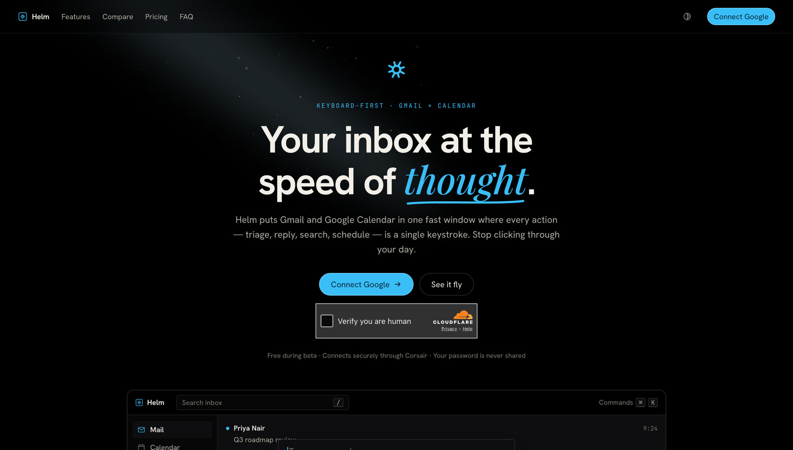

<p align="center">
  
</p>

# Helm

**Live → [helm.houndcode.com](https://helm.houndcode.com)**

A keyboard-first command center for Gmail and Google Calendar. Helm puts
search, triage, scheduling and replies a keystroke away, so email and calendar
work takes fewer steps than the default web apps.

Every Gmail and Google Calendar action runs through [Corsair](https://corsair.dev),
which handles OAuth, token refresh, webhooks and a local Postgres cache of every
synced message and event.

## Try it

- **Live app:** [helm.houndcode.com](https://helm.houndcode.com) — sign in with Google to use it on your own inbox.
- **▶ Demo video:** _recording in progress_ <!-- TODO: drop a 2-min walkthrough at docs/demo.mp4 and link it here -->

> Access is Google-OAuth-only (no guest mode). A short walkthrough video is being
> added so judges who'd rather not connect a real inbox can still see it working.

## How Helm maps to the judging criteria

| Criterion | What Helm does | Where |
|---|---|---|
| **Corsair Integration** | Multi-tenant **and** multi-account; strict `.db` cache reads / `.api` live writes; per-account realtime push for **both** Gmail (Pub/Sub `email→tenant`) and Calendar (`events.watch` `channel→tenant`, channel-token verified); base64url RFC2822 send with CRLF-injection defense; dedupe-by-`entity_id`; cross-user isolation via a single `resolveAccountTenant` gate + a unique tenant index | `server/corsair.ts`, `server/lib/{gmail-watch,calendar-watch,email,users,tenant}.ts`, `app/api/webhooks/route.ts` |
| **Gmail Workflow** | List, semantic + operator search, read/thread, full draft CRUD, send, bulk label/trash/delete (chunked to server caps), all six folders, optimistic edits + 7s undo, per-row account badges | `server/api/routers/gmail.ts`, `app/_components/gmail-panel.tsx` |
| **Calendar Workflow** | Week view, search, create/update/delete, send-invite (`sendUpdates:'all'`), per-account refresh with `timeMin/timeMax`, per-account push, local-midnight all-day boundary handling, `(accountId,id)`-keyed selection | `server/api/routers/calendar.ts`, `app/_components/calendar-panel.tsx`, `lib/calendar.ts` |
| **Productivity UX** | J/K nav, `g`-chords (capture-phase), ⌘K command palette, optimistic label model with in-flight reconciliation, 7s reversible undo, realtime SSE, focus-trapped `aria-modal` overlays, reduced-motion | `app/_components/app-shell.tsx`, `components/command-palette.tsx`, `lib/use-focus-trap.ts` |
| **AI & MCP** | In-process **Corsair MCP** bridged to the AI SDK; `run_script` runs in an **isolated-vm** sandbox (no Node globals, allowlisted tenant-scoped bridge, CPU/mem/result caps); **action-fingerprinted HMAC Confirm/Deny** card replayed server-side with the model out of the loop; multi-account agent with fail-closed ownership; pgvector semantic search; LLM triage | `server/lib/{corsair-mcp,run-script-sandbox,agent-action,agent-policy,sandbox-accounts,semantic-search}.ts`, `app/api/agent/route.ts` |
| **Engineering Quality** | End-to-end typed (tRPC + Zod + Drizzle), passing `build`/`lint`/`typecheck`, a focused adversarial test suite, clean ordered migrations, deployed CSP + HSTS + PKCE + Turnstile | `test/`, `next.config.js`, `drizzle/` |
| **Demo & Documentation** | Live deploy, five real legal pages, this writeup | [helm.houndcode.com](https://helm.houndcode.com), `app/(legal)/*` |

## Security model

- **Sandboxed agent.** The model's `run_script` executes in a bare `isolated-vm`
  V8 isolate — no `process`/`fetch`/`fs`, only an allowlisted, tenant-scoped
  `corsair` bridge; args/results cross as JSON copies, with memory/CPU/wall-clock
  and result-size caps (`server/lib/run-script-sandbox.ts`).
- **Action-fingerprinted confirmation.** Destructive ops (send/trash/delete,
  draft send/overwrite/delete, label edits, calendar writes) are *staged*, then
  HMAC-signed over the exact op + args (including the MIME `raw`, so Bcc/Reply-To
  are bound and shown on the card) and **replayed server-side with the model out
  of the loop** — a prompt-injected recipient substitution can't pass
  (`server/lib/{agent-action,agent-policy}.ts`).
- **Multi-account isolation.** Every Corsair call resolves its tenant only from
  the signed session's own connected accounts and **fails closed** on an unknown
  account/email; a unique tenant index makes cross-user sharing structurally
  impossible (`server/lib/{users,sandbox-accounts}.ts`).
- **Transport & auth.** PKCE (S256) + session-bound OAuth state, signed
  expiring session cookies, Cloudflare Turnstile on connect, timing-safe webhook
  signatures, and a least-privilege CSP + HSTS deployed in production
  (`next.config.js`).

## Stack

- **Next.js** (App Router) and **tRPC** for an end-to-end typed API
- **Postgres** with **Drizzle** — also Corsair's entity cache (+ `pgvector`)
- **Corsair** for the Gmail and Google Calendar integrations
- **Motion** for interface animation

## Corsair features used

Every Gmail and Calendar operation goes through Corsair — there is no direct
Google API call in the app.

- **Gmail plugin** — cached reads (`gmail.db.messages.search` / `list`) and live
  writes (`gmail.api.messages.send` / `modify` / `trash` / `batchModify`,
  `gmail.api.drafts.create` / `update` / `send` / `delete`)
- **Google Calendar plugin** — cached reads (`googlecalendar.db.events.list` /
  `search`) and live writes (`googlecalendar.api.events.create` / `update` /
  `delete` / `getMany`)
- **OAuth + token refresh** — handled by Corsair, per tenant
- **Postgres entity cache** — every synced message and event is cached locally;
  `.db.*` reads never touch Google
- **Webhooks** — `processWebhook` consumes Gmail Pub/Sub and Calendar push
  channels at `/api/webhooks` for realtime updates (no polling)
- **Search API** — `gmail.db.messages.search` with operator filters powers
  advanced search
- **MCP** — `@corsair-dev/mcp` (`buildCorsairToolDefs`) exposes the Gmail and
  Calendar operations as agent tools, with a sandboxed `run_script`
- **Multi-tenant** — `corsair.withTenant` scopes every operation to the active
  connected account

## Bonus tasks attempted

All six bonus tasks from the brief, plus a command palette:

- ✅ **Corsair MCP agent chat** — chat to send mail and create/modify calendar
  invites (`src/server/lib/corsair-mcp.ts`, `src/app/api/agent/route.ts`)
- ✅ **Realtime webhooks** — Gmail + Calendar push through Corsair, no polling
  (`src/app/api/webhooks/route.ts`)
- ✅ **Priority filtering via a cheap LLM** — subject + body classified by
  `deepseek/deepseek-v4-flash` into urgent / reply / fyi / low
  (`src/server/lib/triage.ts`)
- ✅ **Keyboard shortcuts** — `j`/`k` navigation, `g`-prefixed view jumps,
  single-key actions (compose, archive, star, new event, …)
- ✅ **Corsair search API** — operator-aware advanced Gmail search
  (`from:` / `to:` / `subject:` / `is:…`) over the cache
- ✅ **Vector search (sub-second, local)** — pgvector embeddings over the cached
  mail, cosine KNN (`src/server/lib/semantic-search.ts`)
- ✅ **Command palette** — ⌘K (`src/components/command-palette.tsx`)

## Architecture

- `src/server/corsair.ts` — Corsair client (Gmail + Calendar plugins, multi-tenant)
- `src/server/api/routers/*` — tRPC routers; `.db.*` reads hit the cache, `.api.*` writes hit Google
- `src/app/api/webhooks/route.ts` — receives Corsair webhooks to keep the cache fresh
- `src/app/_components/*` — the mail and calendar surfaces
- `src/config/site.ts` — single source of truth for branding and SEO

## Local setup

Requires Node 20+, pnpm and a Postgres instance.

```bash
pnpm install
cp .env.example .env        # then fill in the values
pnpm db:migrate             # apply the schema migrations
pnpm dev
```

### Connect Corsair

Create a Google Cloud project, enable the Gmail and Google Calendar APIs, then:

```bash
pnpm corsair setup --gmail client_id=... client_secret=...
pnpm corsair setup --googlecalendar client_id=... client_secret=...
pnpm corsair auth --plugin=gmail --tenant=dev
pnpm corsair auth --plugin=googlecalendar --tenant=dev
pnpm corsair auth --plugin=gmail --webhooks
pnpm corsair auth --plugin=googlecalendar --webhooks
```

For local webhook delivery, expose `/api/webhooks` with a tunnel and register
that URL during webhook setup.

## Scripts

- `pnpm dev` — start the dev server
- `pnpm build` — production build
- `pnpm typecheck` — types only
- `pnpm test` — run the vitest suite
- `pnpm db:generate` / `pnpm db:migrate` — create and apply timestamped migrations
- `pnpm db:studio` — inspect the database
